# VT100 Serial Terminal

This VT100 serial terminal recreation is approximately 2/3rds [actual size](https://vt100.net/docs/vt100-ug/chapter2.html).
The 3D model was created from scratch in an attempt to be faithful to the style of the original. I also wanted to take advantage of a larger print bed size. It requires a large format print bed (model width is 30cm) to print as is, but can be cut to accommodate smaller print beds. 
The internals accommodate a Raspberry Pi, a small power distribution outlet and a serial port adapter. 

This project was absolutely inspired by the good work of [Michael Gardi](https://hackaday.io/project/177596-23-scale-vt100-terminal-reproduction) and [Lars Brinkhoff](https://github.com/larsbrinkhoff/terminal-simulator). I used the same display hardware, but different serial interface and an upgraded Pi. 

# Enclosure

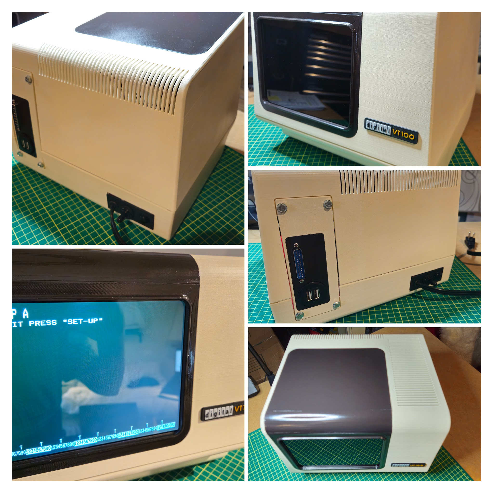


## 3D Model
### Main Enclosure: Top and Bottom
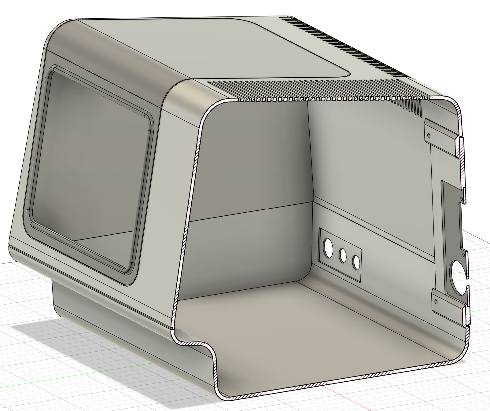
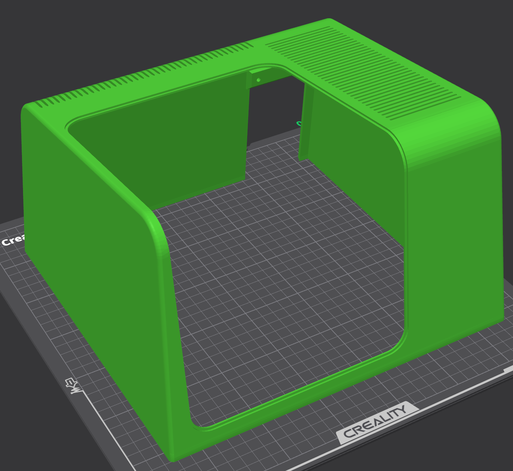
Some improvements I would make:

__Top__
* The lip for the bezel is a bit too shallow (2mm if I remember correctly); it should be widened
* Add guide holes/posts or a ridge along the floor where it would attach to the bottom half to make mating the top and bottom pieces easier to align. 

__Bottom__
* I originally added an inset for the LCD control panel under the overhang so that it would be discrete but accessible. It was just a bit too small to fit the control board. I found I really didn't need access to the controls, so I printed up a small panel to plug the hole later. Either remove it completely or enlarge it to accommodate the control board. 
* Add guide holes/posts or a ridge to compliment the same added to the top part.

__Display__
* Have the display slide into the sleeve from below instead of above. This eliminates any need to destroy the top enclosure when removing the display. 

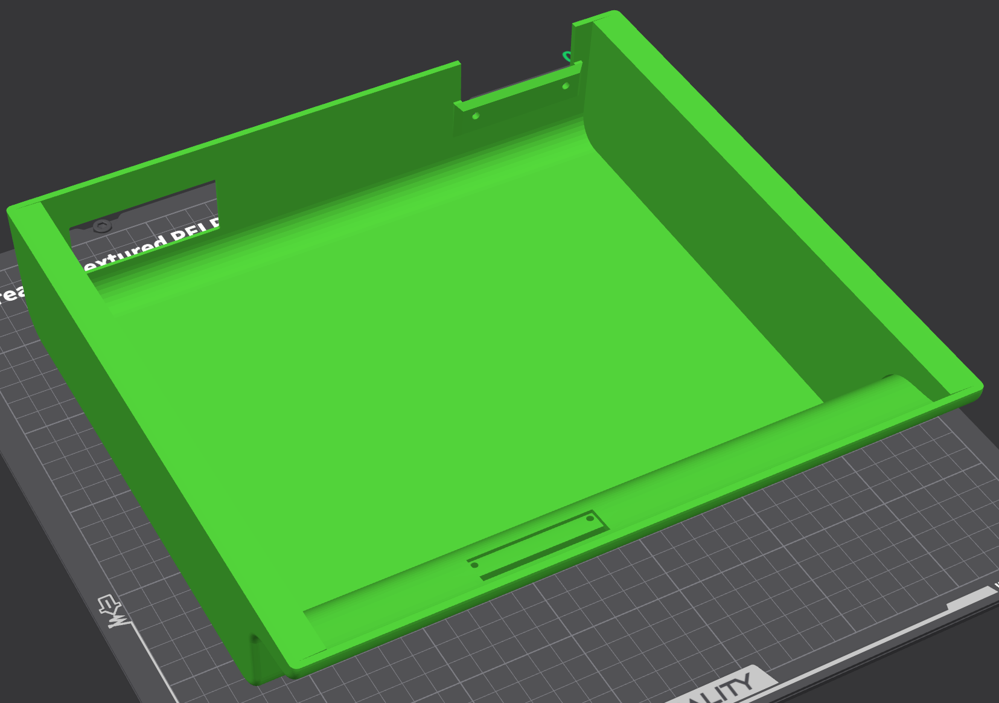

### Attaching Top and Bottom
OK, admittedly this is odd but it works. The bolt is sliced in half and glued *precisely* to the top and bottom halves of the enclosure along the seam (glue while the nut is threaded). When the entire enclosure is sealed up, the back communication panel is screw-fastened, and provides a gap wide enough to get a hand in to thread and un-thread the bolts so that the top can be lifted off. When fastened together, it's strong enough that the entire terminal can be lifted by only the top (not that I would get in the habit of doing this). 
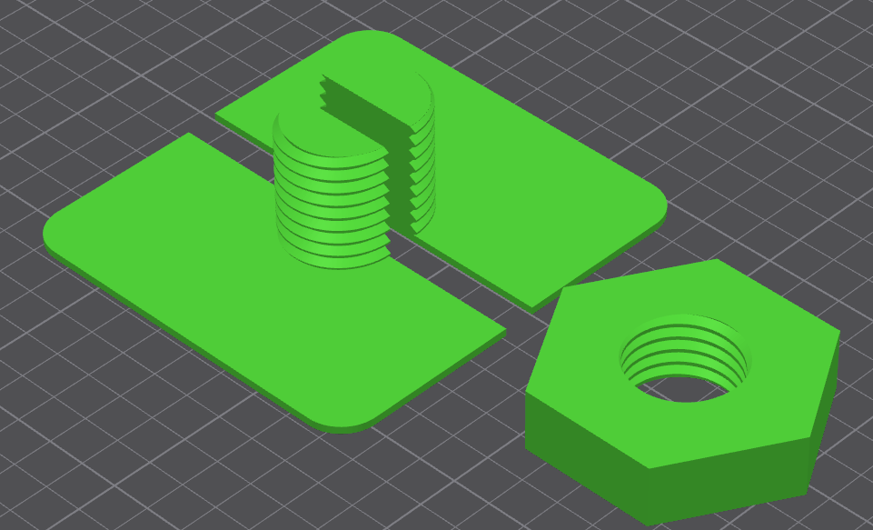

### Main Enclosure: Communication Panel and Power Panel

The inner panel is black and glues into the outer white panel. The entire communication panel is meant to be removable and uses four screws to attach to the bottom and top parts of the enclosure. 

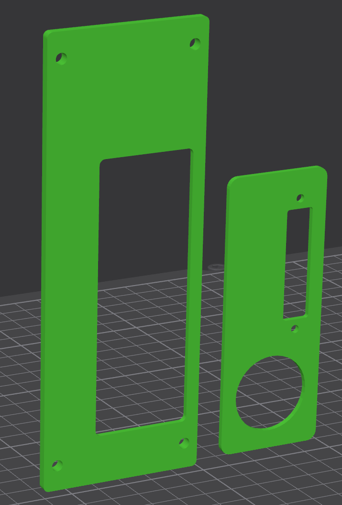

Both the inner communication panel and power panel are designed to allow easy changes without a significant reprint. 

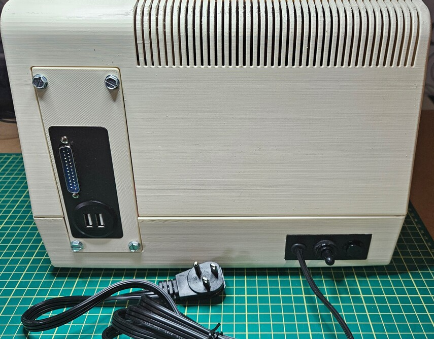


### Internal Mount: Base

The following internal parts are used to provide attachment points to the mounting board that contains all the electronics. It has hex insets to allow for bolts to be inserted before gluing all three pieces to the inside floor of the bottom half. This will leave the bolts standing up. 

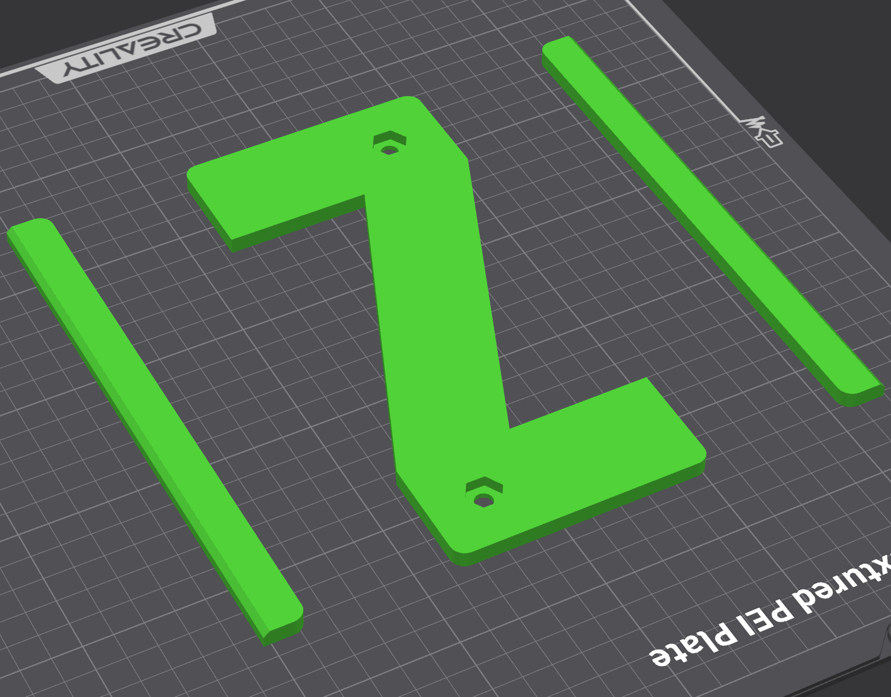

On top of these is a flat mounting board where the Raspberry Pi is installed. While I printed up a board, you can save some filament and simply use thick card stock, cardboard or thin wood. Two holes are needed to allow the bolts to pass through to firmly fix the bounding board tothe bottom half of the enclosure. 
The separate mounting board allows all the electronics and PSU to be worked on without any of the enclosure being needed. Once done, it can easily be dropped in place. 

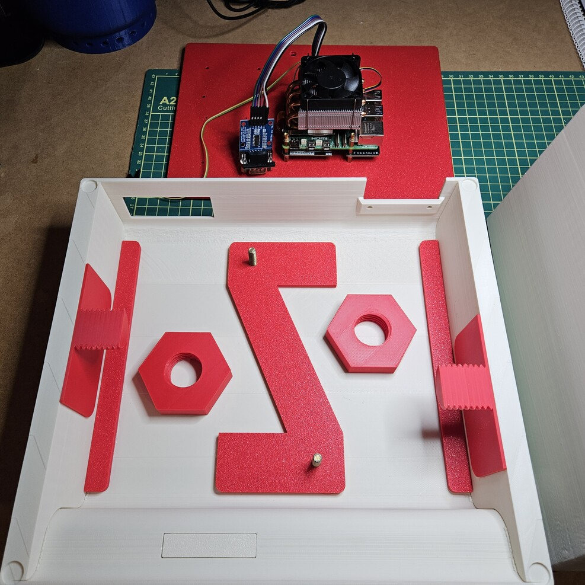

To attach the top and bottom halves of the enclosure I originally intended on using magnets (you can see the four inset circles at each order - these are not part of the model but just added ad hoc in the slicer). Unfortunately I found they were not strong enough. So I came up with a split bolt and nut. The plastic bolt is split and glued between top and bottom halves and the giant plastic nut keeps the two parts together pretty well, while allowing easy disassembly. The large rear, removable communication panel is used to gain access to manipulate the nuts. 

### Internal Mount: Display

The display driver board has a small controller board. Due to cable length, the driver board is pretty much going to be positioned directly behind the screen. I created a couple of "caddies" that allow the boards to be press-fit without needing any tape or glue. The screen itself slides into a tight-fitting sleeve. The purpose of all this is so that the display and driver board can be popped out an reused. The driver board fit isn't as tight as it should be, and really should be mechanically fastened via the corner holes on the PCB.
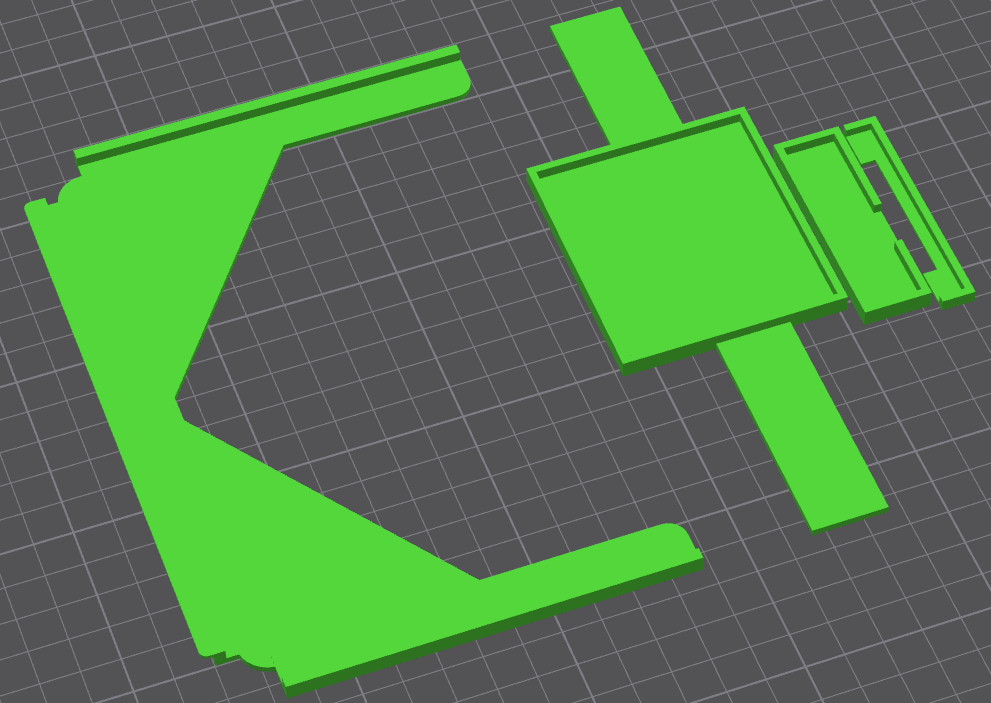

Unfortunately, the display needs to slide out in the vertical direction, which is blocked by the curved roof of the enclosure. 
With some better planning on my part, the screen should have slide into the sleeve from below. That way separating the top and bottom enclosures would have provided a means to slide the LCD out. Oh well. 
I encourage you to build a better display and driver board mount.

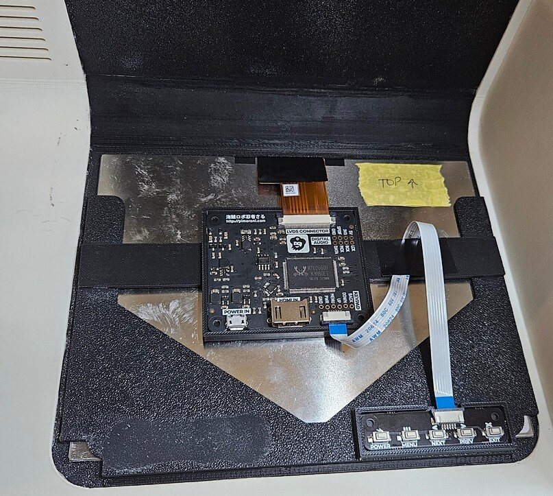

### Bezel

The bezel is composed of three pieces and are meant to be glued into the top half of the enclosure. The display should be attached before the bezel is glued in place.

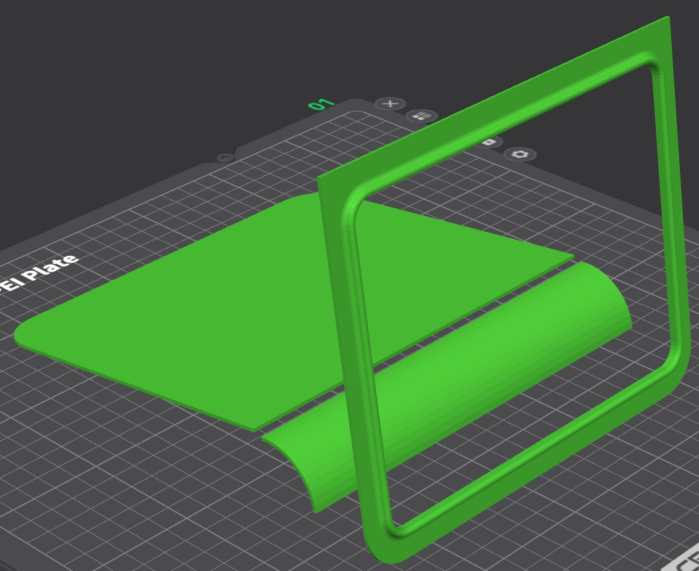

### 3D Model Assets
#### Exterior
| Part | File |
|---|---|
| EVERYTHING | [whole model Fusion360](./3d-models/fusion360/VT100-v42.f3d) |
| Top enclosure | [top stl](./3d-models/VT100-34-top.stl) |
| Top enclosure control panel plug | [control cover stl](./3d-models/VT100-v39-control-cover.stl) | 
| Bottom enclosure | [bottom stl](./3d-models/VT100-v34-bottom.stl) |
| Logo | [digital VT100 stl](./3d-models/Logo.stl), [digital VT100 Fusion360](./3d-models/fusion360/Logo.f3d); Split for multicolor printing: [digital stl](./3d-models/Logo%20digital.stl), [vt100 stl](./3d-models/Logo%20VT100.stl) |
| Power panel | [power panel stl](./3d-models/VT100-target-form-power-panel-v40.stl) |
| Outer communication panel | [comm panel outer stl](./3d-models/VT100-v38-full_comm_panel.stl) |
| Inner communication panel | [comm panel inner stl](./3d-models/VT100-v38-inner_comm_panel.stl) |
| Bezel front | [bezel front stl](./3d-models/VT100-v34-front_monitor_bezel.stl) | 
| Bezel top | [bezel top stl](./3d-models/VT100-v34-top_black_panel_etched.stl) |
| Bezel curved transition | [bezel curved stl](./3d-models/VT100-v34-curved_black_panel.stl) | 

#### Interior
| Part | File |
|---|---|
| Floor mount | [floor mount stl](./3d-models/vt100-mounting_plate_edge%20v6.stl) | 
| Display bracket | [lcd bracket stl](./3d-models/VT100-target-form-bezel-lcd-bracket.stl) |
| Driver PCB mount | [driver pcb mount stl](./3d-models/VT100-target-form-bezel-driver-mount.stl), [driver pcb mount containment bracket stl](./3d-models/VT100-target-form-bezel-containment-bracket.stl) |
| Control PCB mount | [control pcb mount stl](./3d-models/VT100-target-form-bezel-control-board-mount.stl) |
| Giant Bolt & Nut enclosure binder | [bolt top](./3d-models/vt100-case-connector%20top%20v3.stl), [bolt bottom](./3d-models/vt100-case-connector%20bottom%20v3.stl), [nut](./3d-models/vt100-case-connector%20nut%20v3.stl) | 


## Finish and paint

Your 3D prints may have flaws or unsightly artifacts. I used some modelling putty and sandpaper to improve the finish.

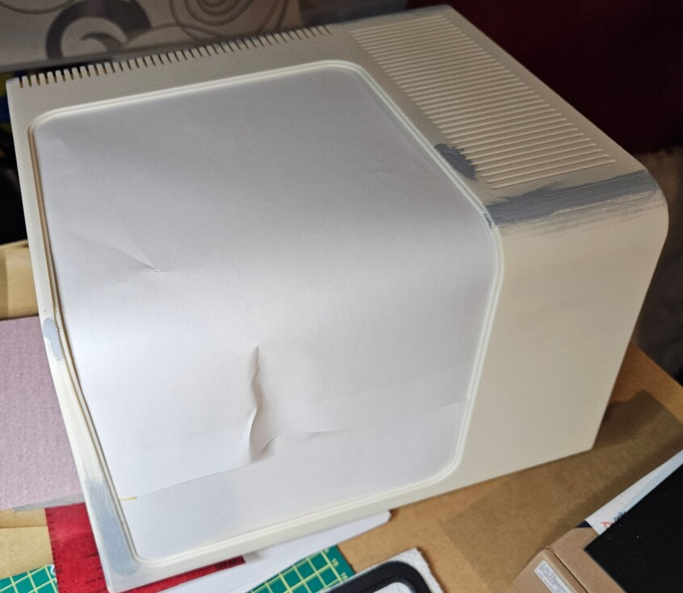
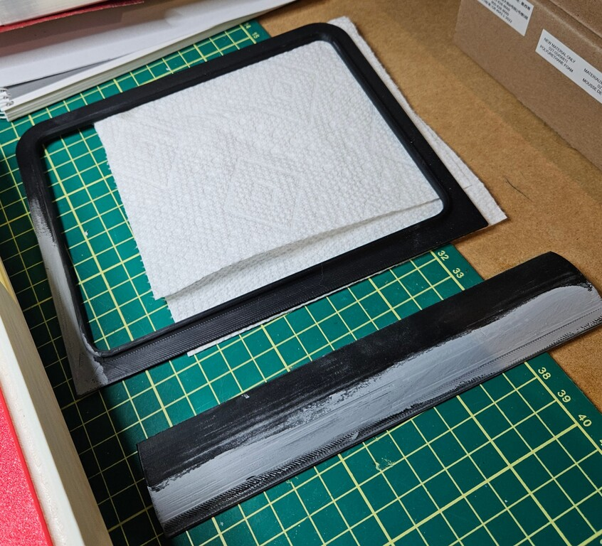

I've seen actual VT-100 terminals in a variety of colors depending upon their exposure to UV light and second-hand cigarette smoke. I wanted mine to look vintage but not dirty. I decided upon an off-white and dark brown, almost black. Several coats of paint help fill any imperfections and contributes to a smoother surface. 

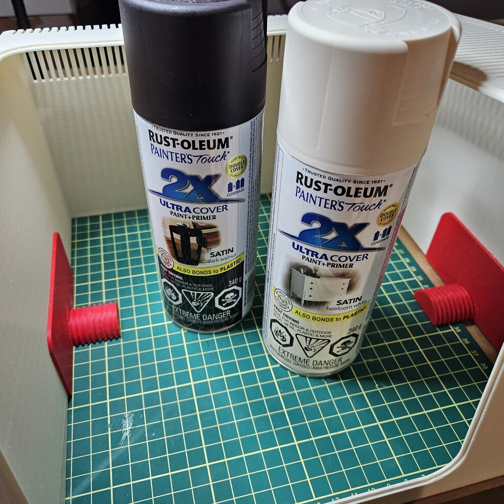

# Electronics

Fundamentally this is just a Raspberry Pi, a standard HDMI driven display, a serial port, a momentary button and a power switch.

## Communications Panel
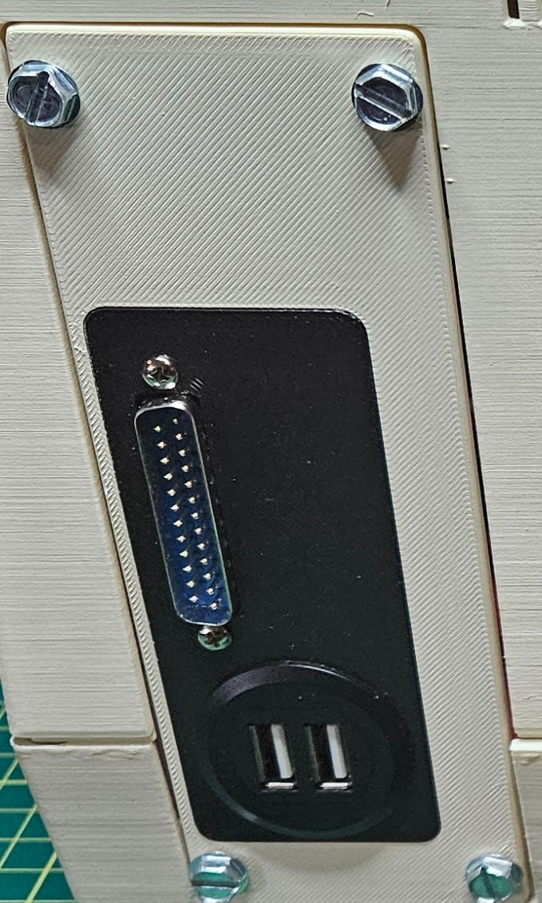

### Serial port
Raspberry Pis have plenty of serial/uart ports. It is possible to add another serial port via USB, but in this case we will use an existing serial port available via GPIO pins and connect it to a serial TTL level converter.
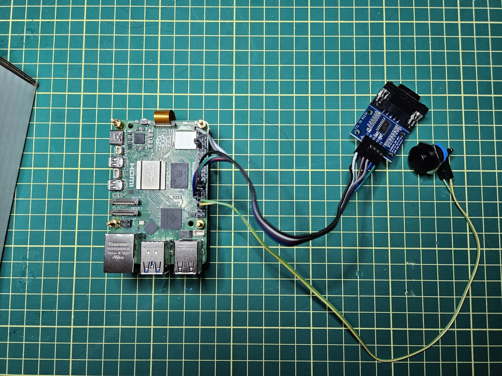


| Serial | Raspberry Pi GPIO |
| --- | --- |
| TXD | UART 2 transmit - GPIO 5 (29) |
| RXD | UART 2 receive - GPIO 4 (7) |
| CTS | clear to send - GPIO 6 (31) |
| RTS | ready to send - GPIO 7 (26) |
| VCC | 3V3 power (1) |
| GND | Ground (9) | 

This particular serial board includes support for CTS and RTS (not mandatory).
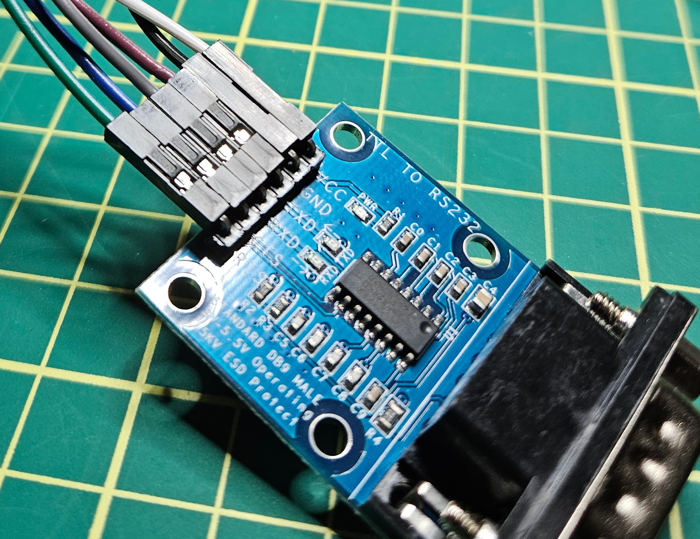

The DB9 expands into a DB25 for added [authenticity](./images/reference/digital_vt100-back-side.jpg).

[DB25 pinout reference](./doc/Serial_PinoutStndrds.pdf)

To be added to _/boot/firmware/config.txt_:
(Note: this overlay is specific to Raspberry Pi 5, so place it under the correct [section](https://www.raspberrypi.com/documentation/computers/config_txt.html#model-filters))
```
# UART 2
# GPIO 4, 5 : TX, RX
# GPIO 6, 7 : CTS, RTS
dtoverlay=uart2-pi5,ctsrts=on
dtparam=uart2=on
```

If successful, you should see a new physical serial port /dev/ttyAMA2 after reboot. 

Documentated use as per dtoverlay help:
```
$ dtoverlay -h uart2-pi5 

Name:   uart2-pi5 

Info:   Enable uart 2 on GPIOs 4-5. Pi 5 only. 

Usage:  dtoverlay=uart2-pi5,<param> 

Params: ctsrts                  Enable CTS/RTS on GPIOs 6-7 (default off) 
```

### USB ports
These simply extend the USB-A ports from the back of the Pi to the back of the enclosure, via the communications panel. 
Generally they are meant for a keyboard and mouse. 

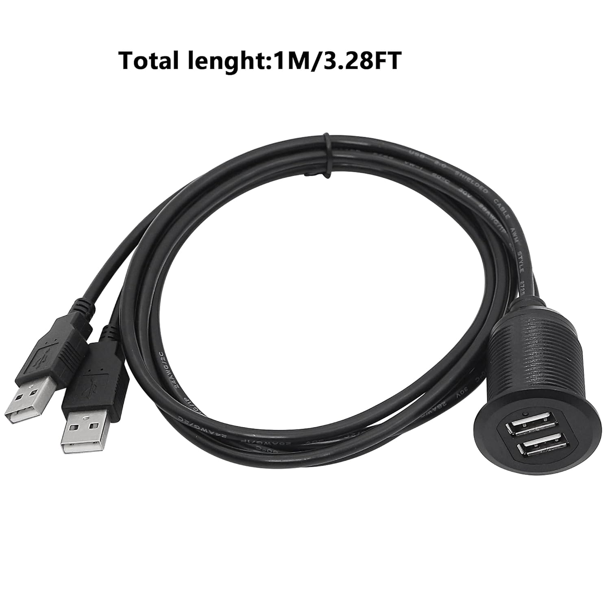

## Power Panel
### Shutdown button
A momentary switch that allows you to initiate a controlled shutdown before shutting off the power.

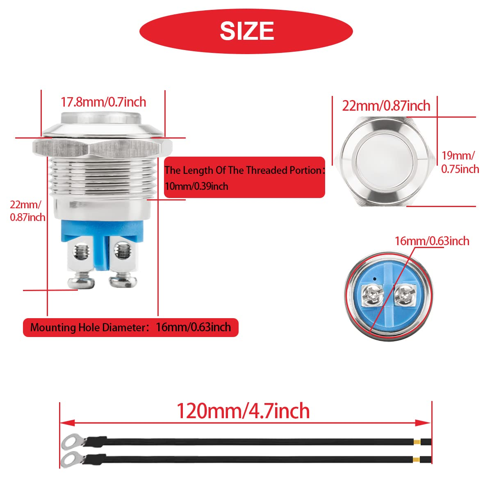

| Button | Raspberry Pi GPIO |
| --- | --- |
| Terminal A | GPIO 16 (36) |
| Terminal B | Ground (34) | 

To be added to the end of _/boot/firmware/config.txt_:
```
# Power off button
# attach to GND + GPIO16
# GPIO is pulled up, pressing the button connects to ground (falling edge=active low)
dtoverlay=gpio-shutdown,gpio_pin=16,gpio_pull=up,active_low=1,debounce=100
```

### Power switch & supply
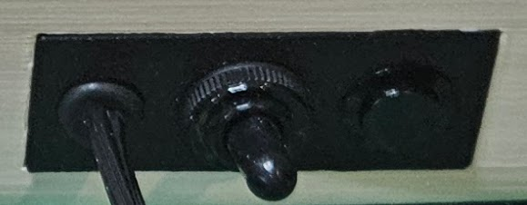

First, it is more authentic to have the AC power cord feed directly into the terminal, rather than having an external power supply. Additionally, the problems with powering both the Raspberry Pi 5 and the LCD display was cumbersome. The RPi5 ideally needed its own proprietary USB-PD power adapter. The LCD was a lot more flexible needing only 5V@1A. 

At first I thought I could simply split the power with an adapter providing 5V via a micro USB-A and 5V via a USB-C, but this didn't work. Because of USB-PD negotiation, the splitter cable needed CC lines supported. However, even then it still didn't work. I abandoned driving everything from the RPi5 PSU. 

I opted to have separate power supplies for the RPi5 and LCD display. To keep things clean and more authentic, I put a really small power bar inside the enclosure. The RPi5 PSU plugs into one of the outlets and a micro USB-A cable connects the power bar to the display driver board. 

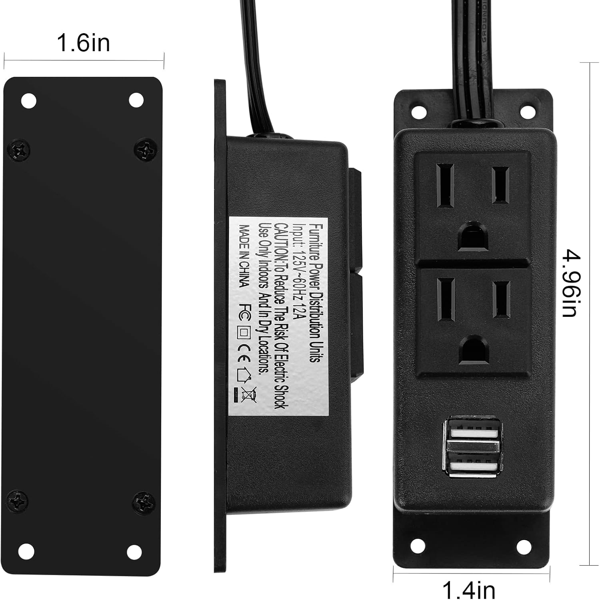

An external power switch will be added to this mini power bar. This will allow power to be cut to the Raspberry Pi and display (once a safe shutdown has been done).
A single-pole, single throw (SPST) switch connected to the "hot" (white) wire will suffice. 
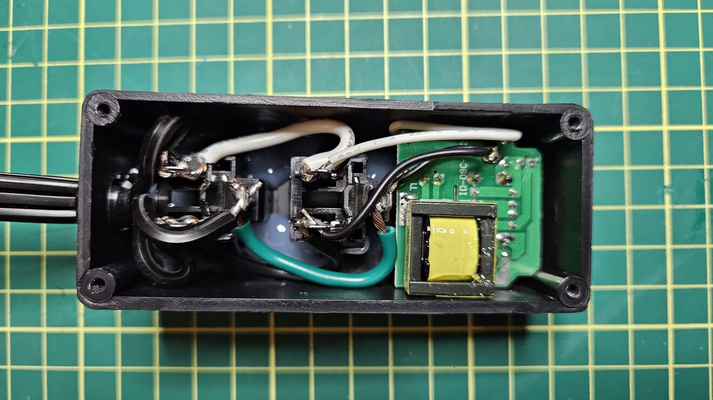

The power cable is desoldered from the outlet and a switch is inserted.

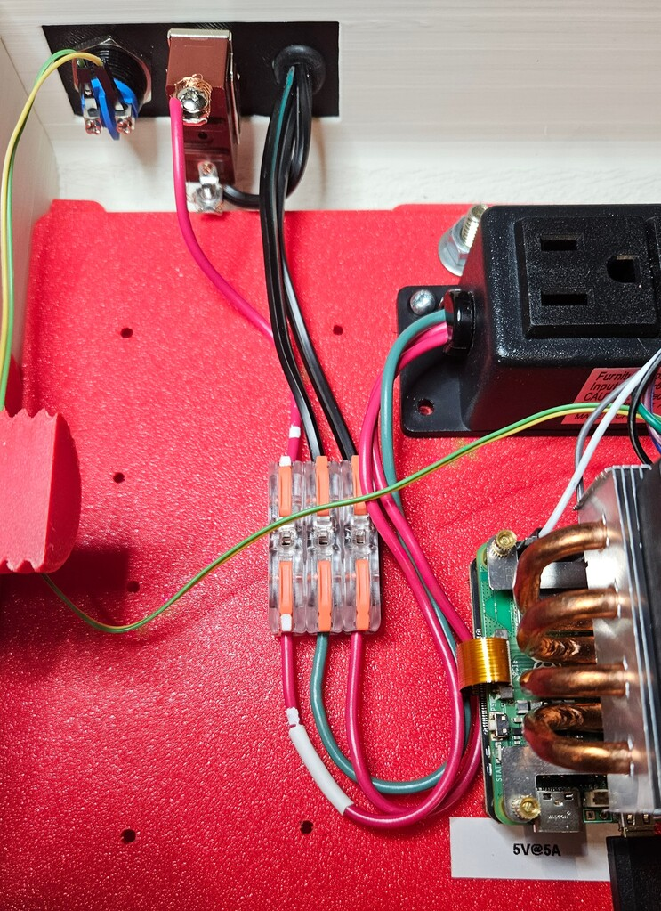

The end result:

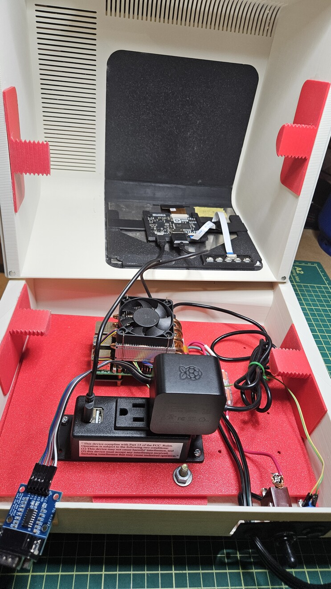


# Software
## VT100 Emulator

The software emulation of the VT100 basically consists of an 8080 emulator with an image of the actual ROM used by the DEC VT100.
This work is from [Lars Brinkhoff's terminal-simulator project](https://github.com/larsbrinkhoff/terminal-simulator)

To compile the vt100 binary, you will need to have SDL2 and SDL2_image libraries installed (sudo apt install).

```
libsdl2-2.0-0
libsdl2-image-2.0-0
```

```sh
git clone https://github.com/larsbrinkhoff/terminal-simulator.git
cd terminal-simulator
make
```

For command line parameters, see https://github.com/larsbrinkhoff/terminal-simulator/tree/master 
```sh
./vt100 -h
```

Run the terminal full screen (F11 also works):
```sh
./vt100 -f
```

By default the program will display the default (bash) shell. 
Press F9 to get to the "Setup A" screen.
From here, press 5 to get to the "Setup B" screen.
This [manual](https://vt100.net/docs/vt100-ug/chapter1.html) or this [manual](./doc/vt100_tech.pdf) provides the configuration details.


At some point you will want to use it as a real serial terminal.

see https://hackaday.io/project/177596-23-scale-vt100-terminal-reproduction/log/193367-make-the-vt100-reproduction-into-a-true-rs232-terminal

```sh
./vt100 -f /dev/ttyAMA2
```

Unfortunately connecting the vt100 binary directly to the serial port didn't work for me, despite a minicom to minicom interaction working flawlessly from the RPi5 to another host. A quick fix is to simply invoke minicom from within the vt100 shell.

### CRT Effects

This is optional of course, but greatly adds to the realism quotient. It will add a curvature to the corners of the display, as well as make the raster lines much more evident, and give a slight CRT glow to the pixels. Amber, green and white are supported. You will need a more powerful Raspberry Pi for this. Probably a Pi 4 as a minimum. On the Pi 5, the vt100 binary at idle is about 15%. 

```
The command line syntax for vt100 related to visual effects:

-f enters full screen. Toggle with F11.

(white is the default)
-a set pixel color to amber.
-g set pixel color to green.

-c CUR screen curvature (0.0 - 0.5, requires OpenGL)

-2 magnify by 2; each additional -2 adds 1 to multiplier.

-N DIV reduce recomputation of screen to 60/DIV Hz (may run faster).
-Q disables use of OpenGL (may run faster).

```

# Bill of Materials

| Item | Image | Description | 
|---|---|---|
| Raspberry Pi 5 | | A Raspberry 3 or 4 are acceptable substitutes. Compute power is only really needed when rendering the screen as a CRT |
| PCI to NVMe | 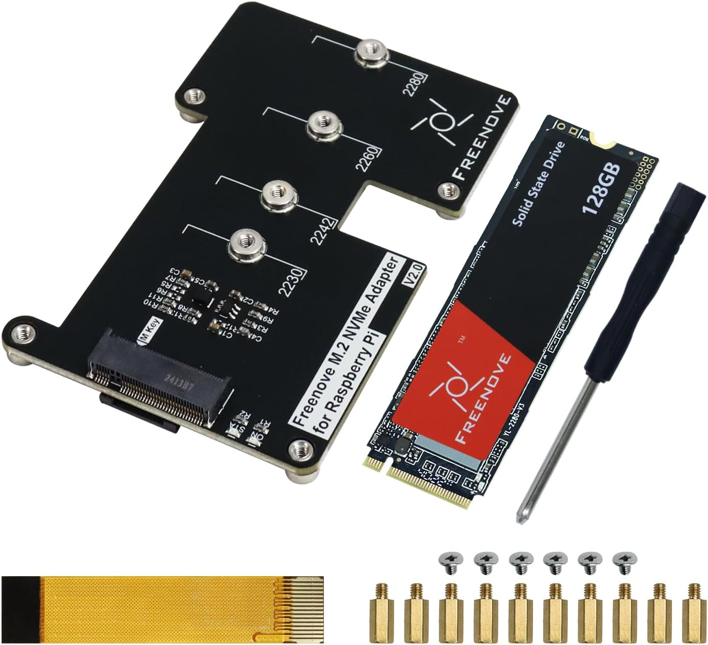 | (Optional) A viable option for a Raspberry Pi 5, otherwise simply use the SDcard | 
| Heatsink | | | 
| USB-A (female) extension |  | To connect USB ports on Raspberry Pi to back of enclosure (via communication panel); used for keyboard (and optional mouse) |
| Serial adapter| 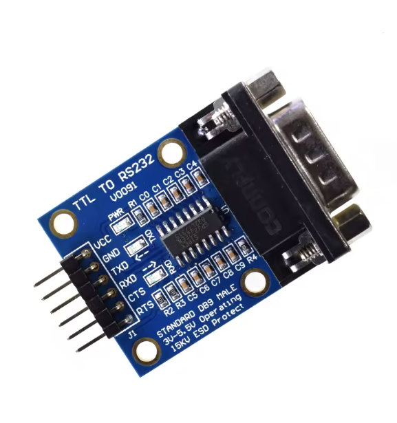 | TTL serial level shifter with CTS and RTS support (not strictly necessary) from [Aliexpress](https://www.aliexpress.com/item/32826758471.html) |
| DB9 to DB25 adapter | 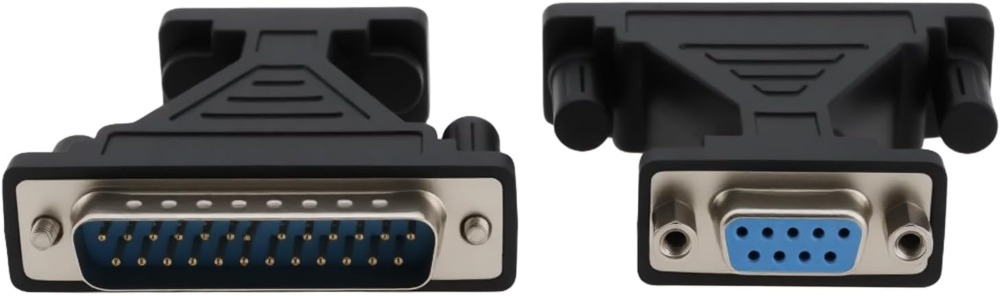 | (Optional) Not strictly necessary, but added for authenticity since the actual VT100s had DB25 serial connectors |
| Display | 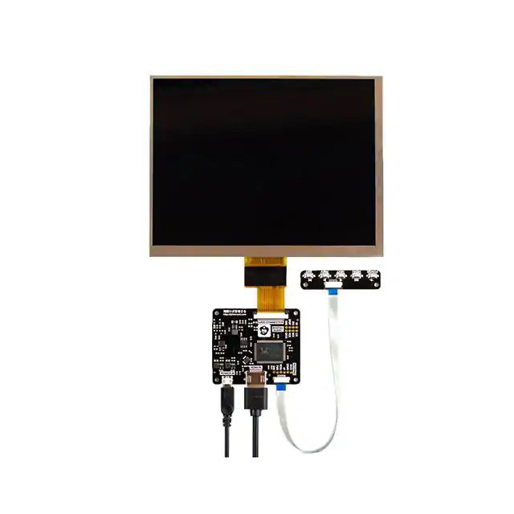 | HDMI 8" IPS LCD Screen Kit (1024x768) by Pimoroni [PIM372](https://shop.pimoroni.com/products/hdmi-8-lcd-screen-kit-1024x768?variant=12559868133459) - 4:3 ratio; any 8" 4:3 display with HDMI input should suffice |
| Micro HDMI to full HDMI cable | 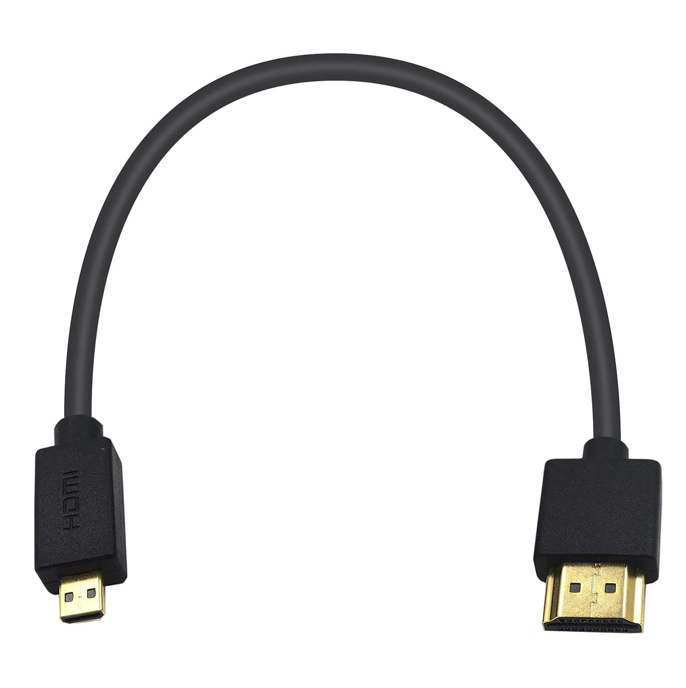 | About 10cm; micro-HDMI is specific to Raspberry Pi 5 & 4 |
| Momentary switch |  | Used to initiate system shutdown |
| SPST switch | 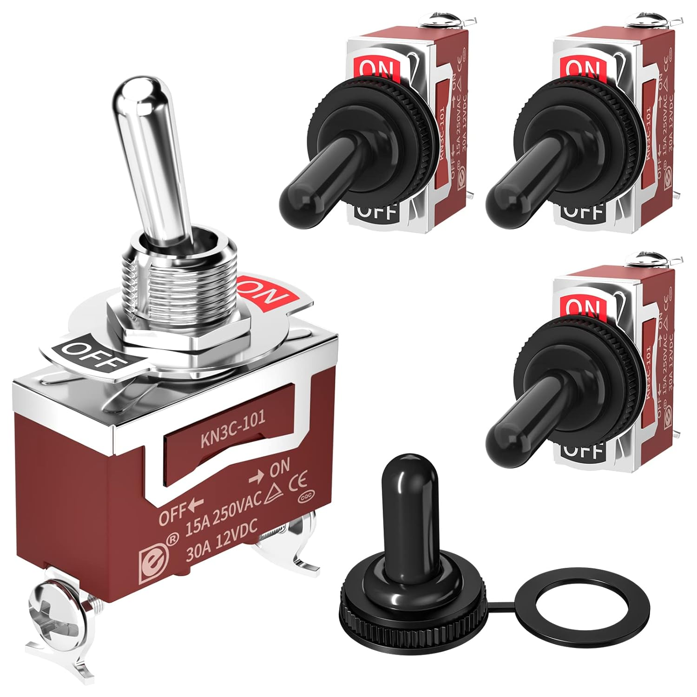 | Used to disconnect main power |
| Power bar |  | Small enough to fit inside the enclosure. [Amazon link](https://www.amazon.ca/dp/B098QT653G) |
| Raspberry Pi 5 Power supply | 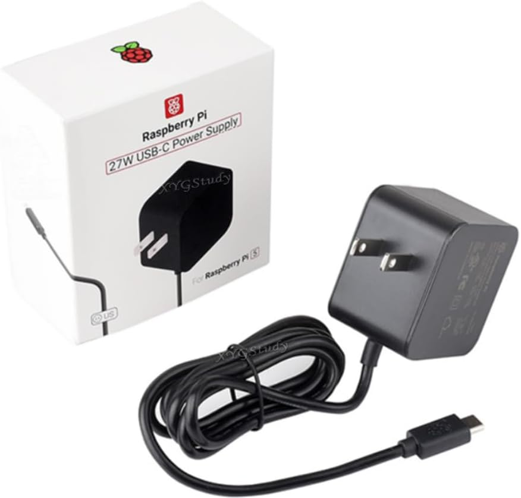 | Not strictly necessary as a PSU with less amps will work (with warnings on a Pi 5); Raspberry Pi 5 PSU delivers USB-PD power of 5V@5A - this is not supported by the USB Power Delivery standard and so requires a special power supply (standard USB-PD delivers 5V@3A) |
| Micro USB-A (male) to USB-A (male) power cable |  | Used to power the display; about 10cm should suffice. Plugs directly into the power bar |
| grommet |  | (Optional) Used to pass the AC power cable out the back of the power panel on the enclosure. Diameter: 3/8", ID: 0.244", OD: 17/32"
| 4 screws (for communication panel), 2 screws (for DB25) |  |  |
| bolt + washer + nut x2 | | Used to secure the mounting board to the bottom-half enclosure |
| Rustoleum paint<br>Heirloom White<br>Dark Walnut | 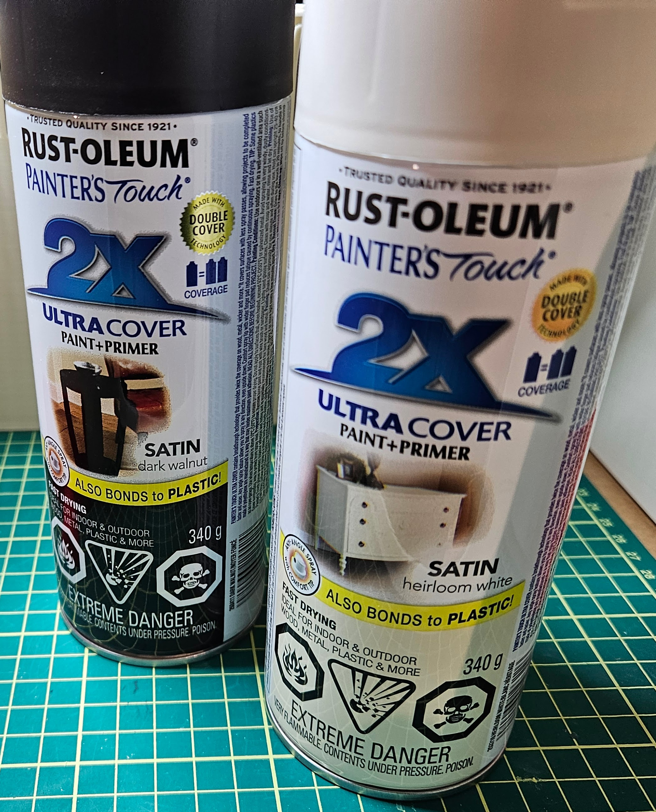 | White: Top and bottom enclosure and outer communication panel<br>Black: Bezel, power panel and inner communication panel<br>Paint is optional, but I found  that filler, sandpaper and paint can cover many 3D print imperfections. |

## Future Enhancements

* Add speaker
* Find a thematically suitable keyboard